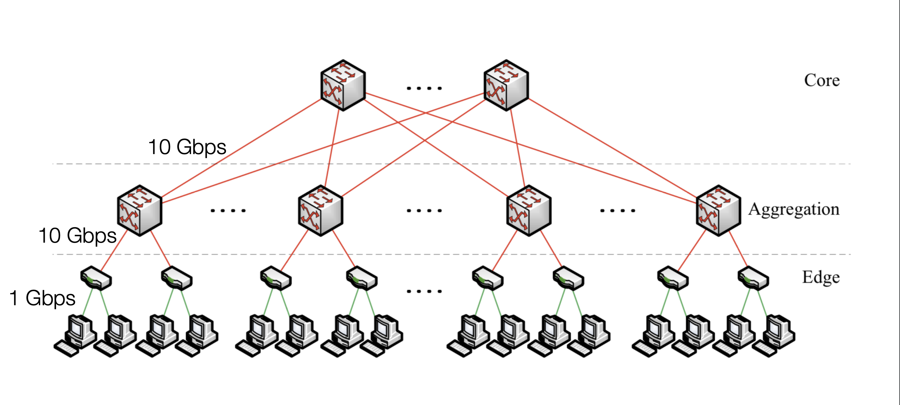
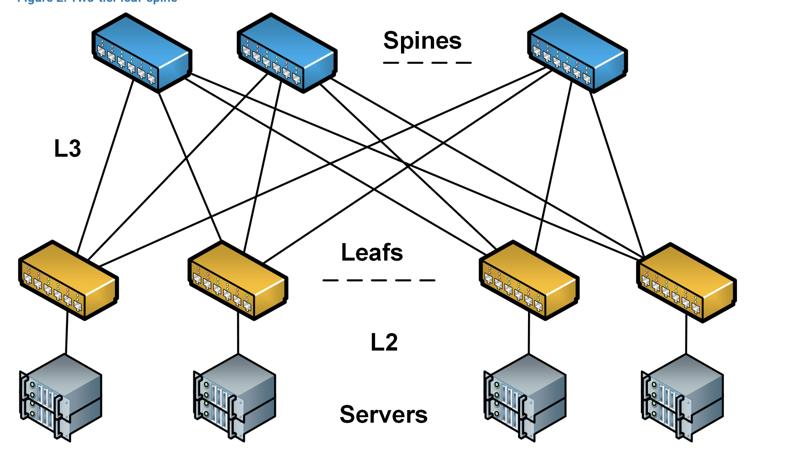
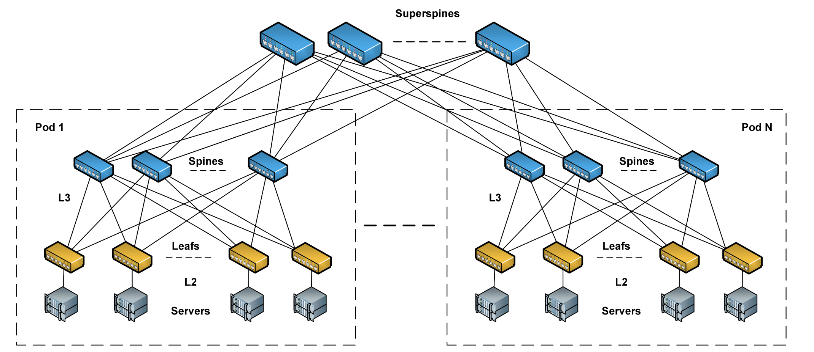
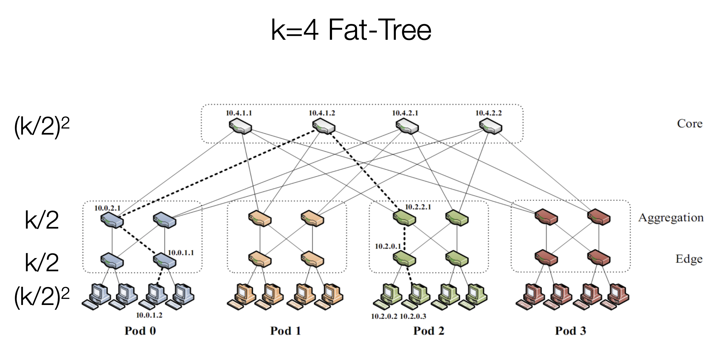
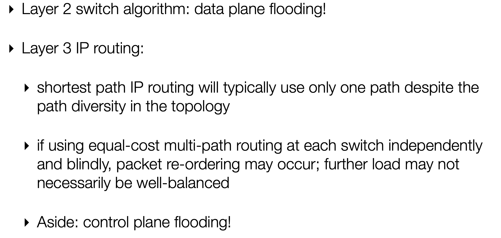
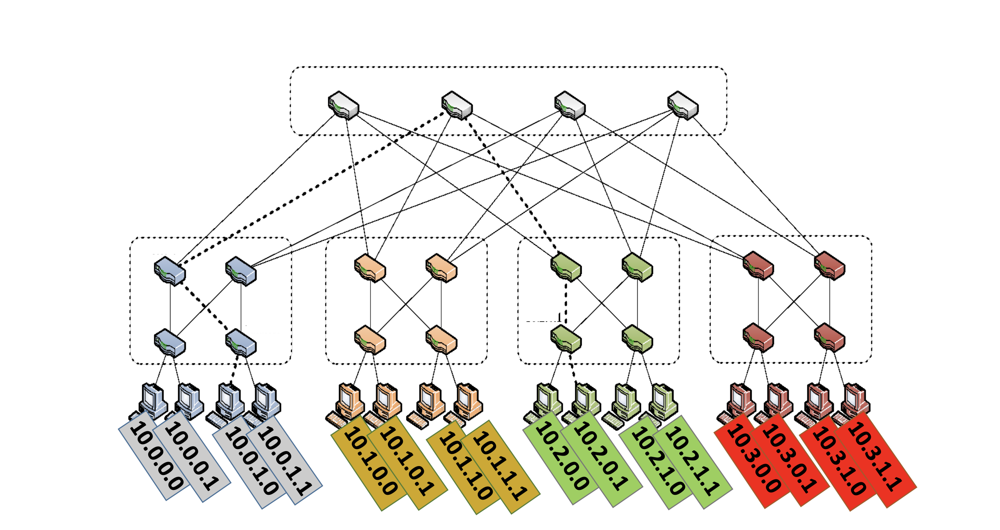
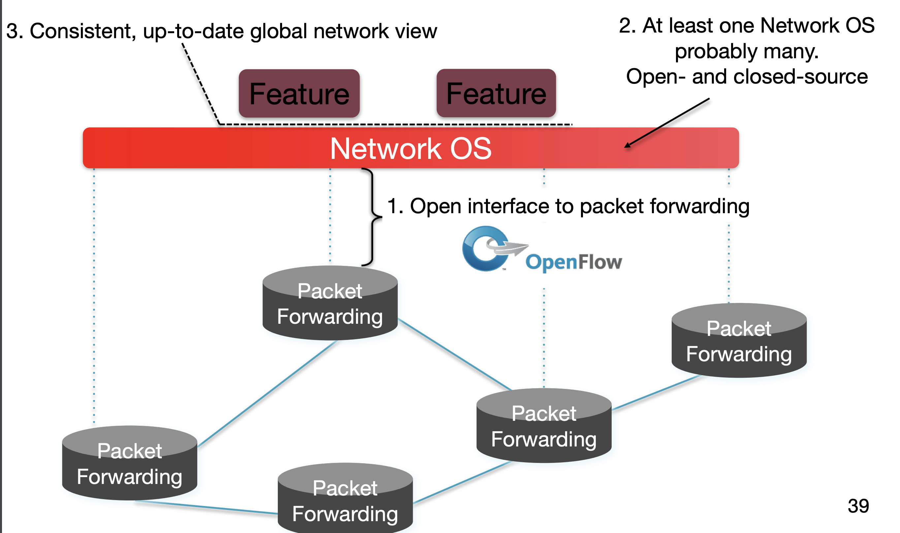

# Datacenter Networking

### Traditional Datacenter Networking

 

A hierarchy structure.

##### Problem

- Core level node handle too much traffic, became bottleneck. 10 GBs is too little amount of data.
- Most traffic happens inside the datacenter, and too many hops for the most left node to reach most right node.
  - Replications
  - Nodes communciation

### CLOS Network

 

Fully mesh connectivity between leaf switches and spine switches. Providing stable, predictable, and many-choice network. Every node can reach other node within the same sub-network in 2 hops.

It's possible to add an additional layer, the core layer, for larger datacenters. But adding more layer will make edge port capacity improvements diminish significantly. It's possible to fully mesh the connectivity between spine layer and core layer; however, it can be expensive and unfeasible in real case.

 

### Clos Topology (Flat-tree)

- Cheaper
- Easier to scale
- NO/low oversubscription
- HIgher path diversity

K-ary flat-tree: three layer topology(edge, aggregation, and core)
- each pod consistes of (k/2)^2 servers and 2 layers of k/2 k-port switches
- each edge switch connects to k/2 servers ad k/2 aggr. switches
- each aggr switch connects to k/2 edge & and k/2 core switches

 

#### Problems of Flat-Tree

 

### Solution 1 for Forwarding - Topology-aware addressing

The ip address are assigned based on some pattern.

 

- Address embed location in regular topology
- Maximum entries/switch: k (=4 in example)
  - Constant independent of number of destinations
- No route computation/ messages/ protocols
  - Topology is hard-coded, but still need localized link failure detection
- Problems
  - VM migration: ideally, VM keeps its IP when it moves
  - Vulnerable to misconfiguration

#### Diffusion Optimizations

- Flow classification
  - Denote a flow as a sequence of packets with the same entries; pod switches forward subsequent packets of the same flow to same outgoing port, and periodically reassign a minimal number of output ports
  - Eliminates local congestion
  - Assign traffic to ports on a per-flow basis instead of a per-host basis, ensure fair distribution on flows
- Flow scheduling
  - Pay attention to routing large flows, edge switches detect any outgoing flow whose size grows above a predefined threshold, and then send notification to a cnetral scheduler. The central scheduler tries to assign non-conflicting paths fo rthese large flows
  - Eliminates global congestion
  - Prevent long lived flows from sharing the same links by assign them to different links

### Solution 2 for Forwarding - Centralized + Source Routes

- Centralized "controller" server knows topology and computes routes
- Controller hands server all paths to each destination
- Server inserts entire path vecyor into packet header
  - header: [dest=D, index=0, path={S5, S1, S2, S9}]
  - index++. next-hop = path[index]
- No entries for switches
- Routing message broadcast from controller to all servers
- Pro
  - Switches very simple and scalable
  - Flexibility - end-points contol route selection
- Cons
  - Scalability/robustness of controller (SDN issue/ Software Defined Networking)
  - Clean-state design of everything

### Software Defined Networking (SDN)

 

#### Network OS

A distributed system that creates a consistent, up-to-date network view
- Runs on servers in the network
- NOX, ONIX, Trema...

Uses forwardin abstraction to
-   Get state information **from** forwarding elements
-   Give control directives **to** forwarding elements
