# Key Value Store

Also called a **Distributed Hash Table** (DHT), partition set of key-values across many machines

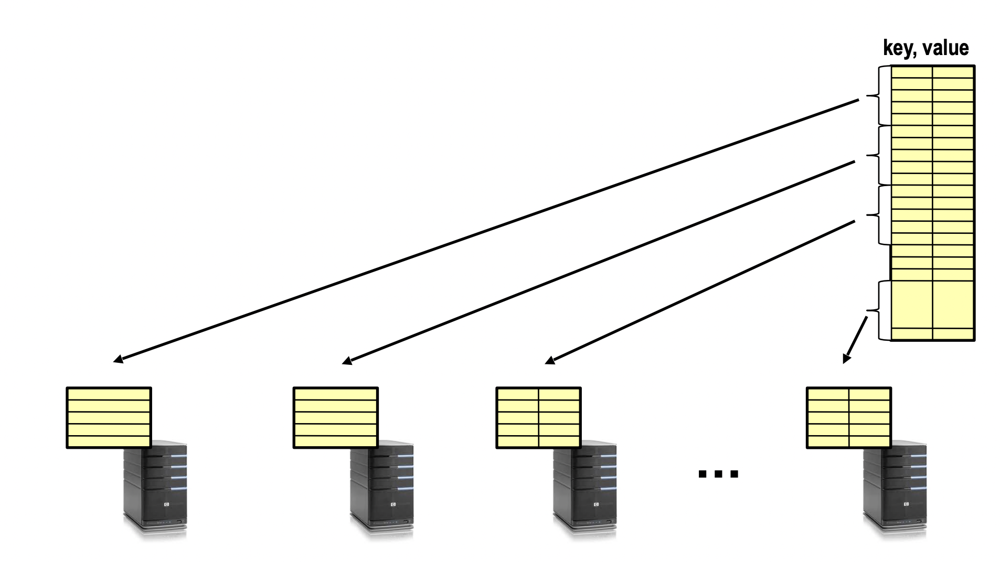

#### Examples

- Amazon
  - Key: customerId
  - Value: customer profile

- Facebook, Twitter
  - Key: userId
  - Value: user profile

- Distributed file systems
  - Key: Block ID
  - Value: Block

#### Challenges

- Scalability
  - Need to scale up to thousands of machines
  - Able to add new machines easily
- Fault tolerance
  - Handles failures without lost key-values and degradation in performance
- Consistency
  - Maintains key-values consistent in case of node failures and message loses


## Directory Based Architecture

Having a node maintain the key value mapping between keys and machines that store the values. A **master node stores info of key-node** in key value pairs.

When retrieve, or store values, it first goes to master to get the node of the value been stored. Then go to the actual node for the real value.

### Implementation
- Recursive query - master relay the request to Node, Node respond value to master, master then respond the value to user
  - Master may become bottleneck of the performance
  - **Pro**
    - Better performance as **Master** typically closer to **Nodes**
    - Easier to maintain consisitency as Master can serialize puts()/gets()
  - **Cons**
    - Hard to scale bc Master may become bottleneck
- Iterative query - user get Node number from master, then go to Node to get the value
  - Seems a more distributed way of doing things
  - **Pros**
    - More scalable
  - **Cons**
    - Slower as client usually is further
    - Hard to enforce data consistency


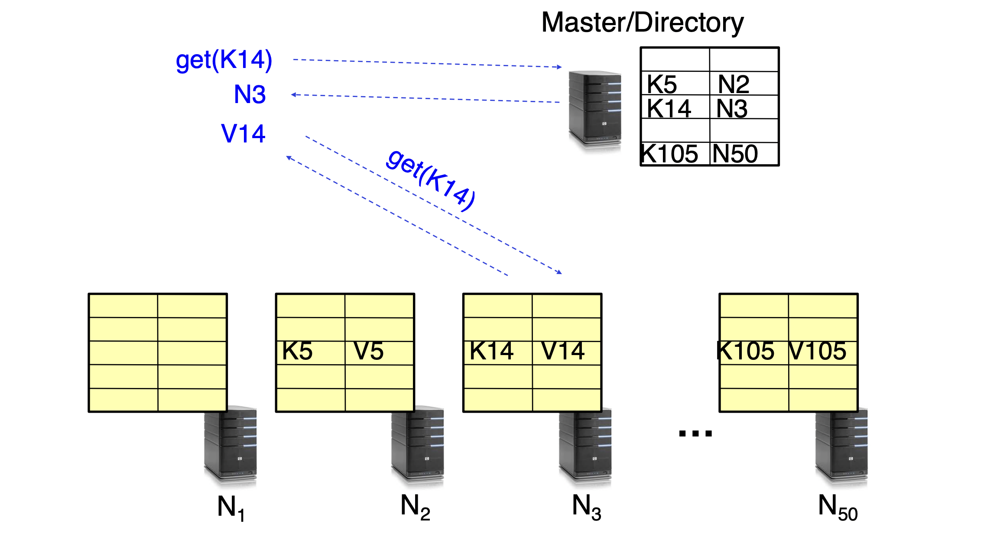

### Failure Tolerance

Replicate value on several nodes, usually on different racks in a datacenter to guard against rack failures

We can do it Recursively or Iteratively

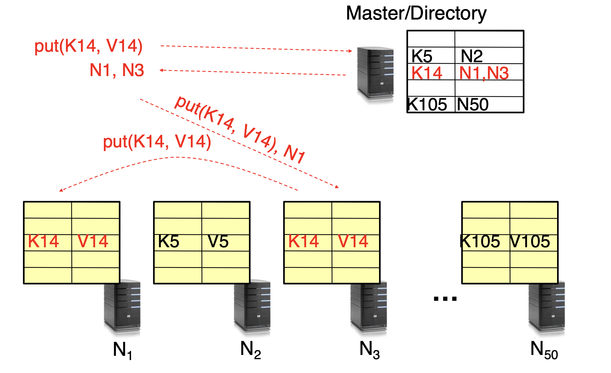
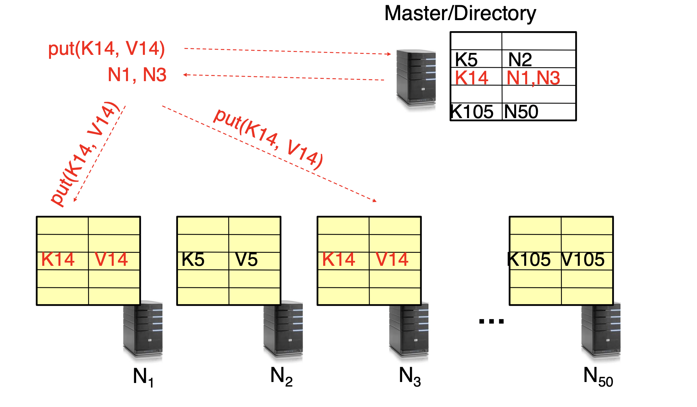


### Scalability

- Storage - use more nodes
- Request throughput
  - Can serve requests form all nodes on which a value is stored in parallel
  - Master can replicate a popular value on more nodes
- Master/ directory scalablility
  - Replicate it
  - Parition it, so different keys are served by different masters/directories
- Load balancing
  - Master keeps track of the storage availability at each node, prefer nodes that have more storage
  - When adding new node
    - Move heavy loaded values to it beside add new values
  - Failures
    - Replicate values from failed node to other nodes

### Replication

- Making sure values is been replicated on other nodes
  - Wait for acknowledgement from every node
- Fail during replication
  - Pick another node and do it again
- In general, with multiple replicas
  - Faster get, slower put


### Consistency

#### Quorum Consensus - eventual consistency as an inherent feature

N = number of replicas in a distributed system
W = a write quorum of size W. For a write operation to be considered successful, the write should be acknowledged from W replicas.
R = a write quorum of size R. For a read operation to be considered successful, the read must wait for reponses form at least R replicas

```
Generally, if there are N replicas, every write must be confirmed by W nodes to be considered 
successful and we must query at least R nodes for each read.
```

Therefor, N = 3, R = 1 means at least one reponse from replicas is considered successful read.
The parameters of N, W, and R are configurable. Typically N is chosen to be an odd number, and set W = R = (N + 1)/2. W + R > N makes the system tolerable to unavailablilty and ensures consistency.

With N=3, W=2, R=2 we can tolerate 1 unavailable node.

With N=5, W=3, R=3, we can tolerate 2 unavailable nodes and so on.

##### Read and Writes trade-off:

If R=1 and W=N, then the system is optimised for faster reads.

If W=1 and R=N, then the system is optimised for faster writes.


### Scaling Up Directory

#### Challenge
- Directory contains tens or hundreds of billions of entries (key, value)
- Each query involves master node

#### Consistent hashing - master node no longer store keys

Associate each node an unique *ID* (this unique id can be given by hashing the name of server) in an *uni*-dimensional space

-   Partition this space across M machines
-   Keys are in same uni-dimensional space
-   Each (key, value) is stored at the node with the smallest ID larger than Key
-   If one node is down, contents of the node are moved to the next living smallest ID node.  
-   Keys of the pairs no longer need to be store on master node, since we know the one with smallest ID larger than key is the node.

A **problem** with consistent hashing is that nodes are not likely to be distributed evenly on the **ring**. This is solved by using virtual nodes (or many pointers of the node), many virtual nodes represent one actual node. Therefore, each nodes handles multiple segments on the ring and the problem with uneven distribution of nodes on the ring is greatly reduced.

##### Why not use Modulo hashing

 - Considering object id **X**, and **K** servers

 - Place ***X*** on server ***i* = hash(X) mod *K***

 - **Problem** - Changing number of servers

   - All entries need to be remapped

#### Chord Finger Table - master node no longer be involved in each query

**Key Idea**: route request from node to node until reach the node storing request's key

**Basic Lookup**: pass to next node until reach the goal. This is O(n) operation

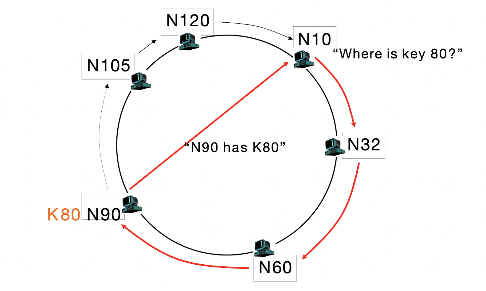

**Finger Table** - O(logn)
- each node store a table that is size logn
- O(logn) hops
  - each hop go at least 1/2 way(current distance) towards destination because each finger points x2 id of next node
  - if hops to the largest node that is smaller than key in the table, it means goal node is in the other half
  

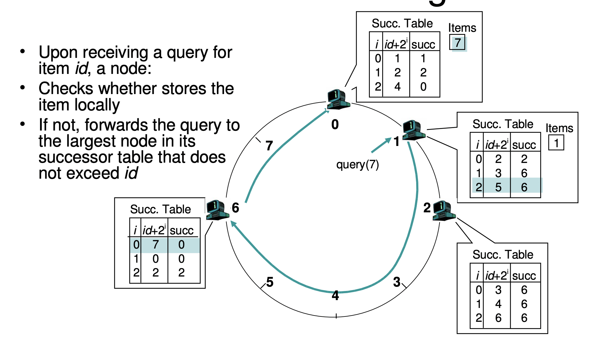 


### Case Study - Amazon Dynamo Key-Value Store

- **Consistent hashing** broadly useful for replication - not only P2P system
- Extreme emphasis on **availablity and low latency**, unusually, at the cost of some inconsistency
- **Eventual consistency** lets writes and reads return quickly, even when partitions and failures
- **Version vectors**, allow some conflicts to be resolved automatically, others left to application

#### Dynamo's Interface

- **get(k)**, and **put(k, v)**
  - **get(k)** -> value, context
    - returns one or multiple value conflicting values
    - context describes versions of values
  - **put(key, context, value)** -> "OK"
  
#### Low latency, availability, and response time over consistency
**Place** replicated data on nodes with consistent hashing

**Replicate** using **vector clock** - meaning each replica maintain a logical clock. When a node receive an update, it increment its clock and sends updated clock with updated data to other node. Then the next node will compare the clock, merge to itself if the clock is more updated, and repeat the step.

**Eventual Consistency**: data is not updated to all replicas immediately, propagate through replicas and eventually be consistent, that's why return multiple conflict value

**Coordinator**: the node that suppose to store the key value on hash ring of consistent hashing
**Replicas**: typically the next N nodes on the hash ring unless they are not available, in this case, it moves further and beyond N

**Preference List**: next M nodes, and M > N to account for node failures

#### Gossip and "lookup"

- Each node randomly contact other node on the ring, share their lists of known nodes, to achieve constant time hop

#### Sloppy Quorum

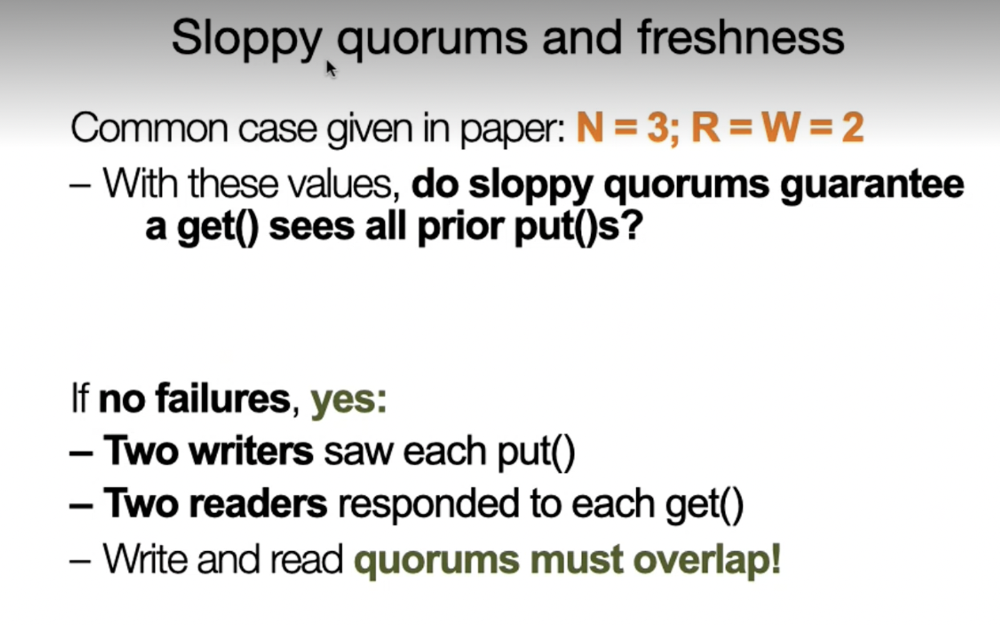

##### Hinted Handoff

pass data beyond N nodes(replicas) if they fail to reach W or R success. usually are on preference list

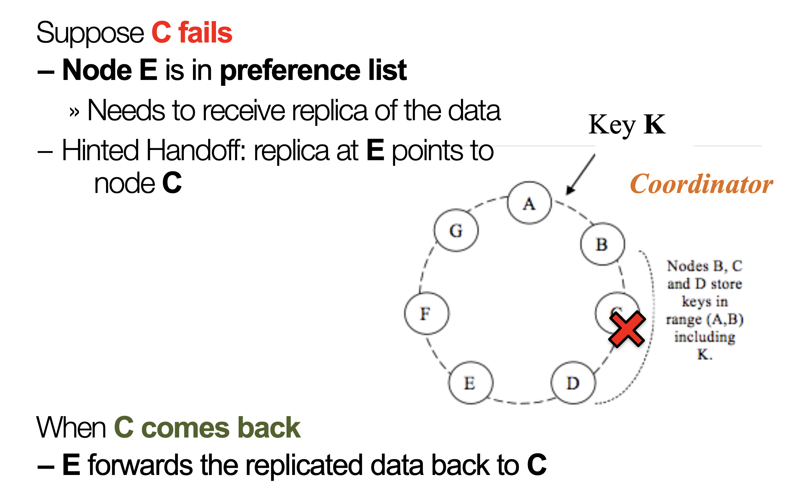

##### Does sloppy quorums guarantee get() sees all prior put()?

- If no node fails, **Yes**
  - Because W and R overlap
- If node fail, **No**
  - W and R may not overlap all nodes on preference list, and guaranteed not overlap nodes beyond preference list

##### Conflicts

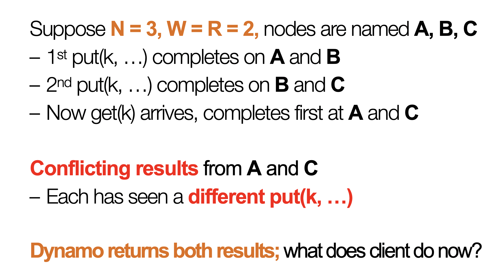

**Shopping Cart**
- take union of 2 shopping carts
- possible that more updated put() has deleted an item 
  - results in **resurrection** of an item

**Vector Clock** - drops the version that has lower value
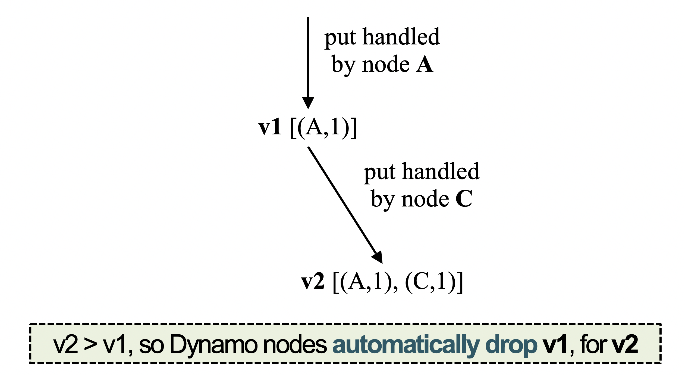
**Reconciliation** - multiple put() can process concurrently so they have a conflict but still have same vector clock value. Dynamo returns all value and let the application or client make the decision to keep which one or union them. All up to client.
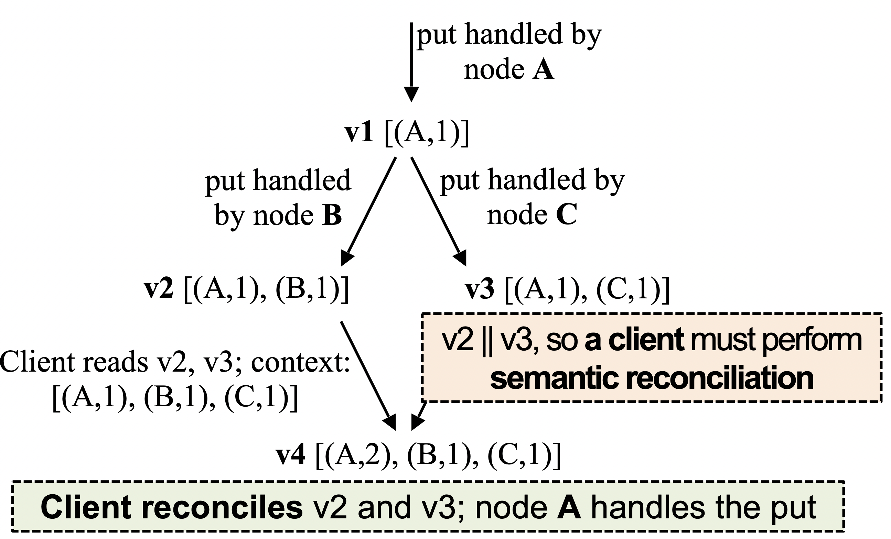

##### What if hinted handoff node crashes before forward data to nodes on preference list

**Replica Synchronization**
- Nodes nearby on ring perodically gossip
  - Compare the (k, v) pairs they hold
  - Copy any missing keys the other has
  - Using Merkle Tree to do this efficiently and quickly

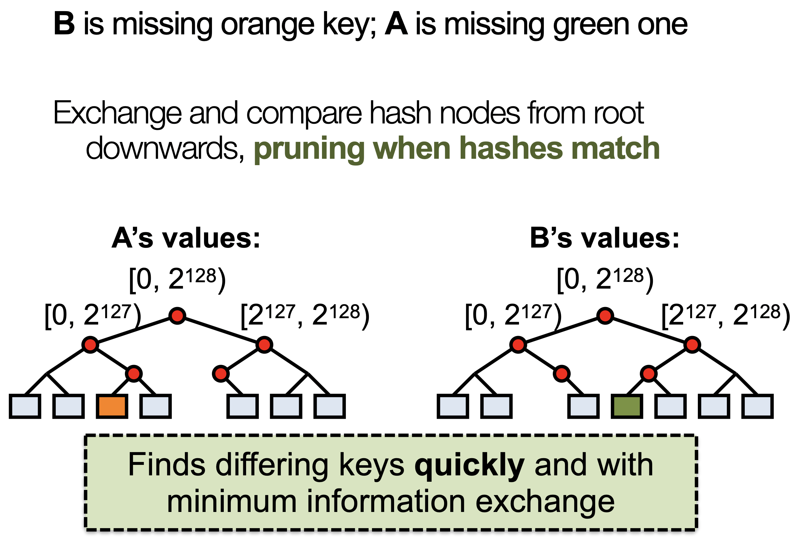