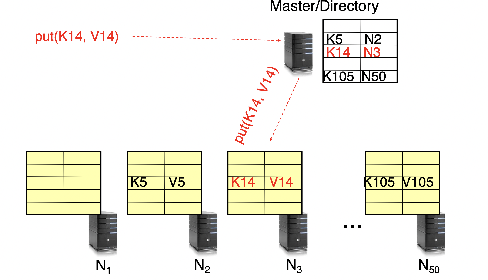

# Key Value Store

Also called a **Distributed Hash Table** (DHT), partition set of key-values across many machines


#### Examples

- Amazon
  - Key: customerId
  - Value: customer profile

- Facebook, Twitter
  - Key: userId
  - Value: user profile

- Distributed file systems
  - Key: Block ID
  - Value: Block

#### Challenges

- Scalability
  - Need to scale up to thousands of machines
  - Able to add new machines easily
- Fault tolerance
  - Handles failures without lost key-values and degradation in performance
- Consistency
  - Maintains key-values consistent in case of node failures and message loses


## Directory Based Architecture

Having a node maintain the key value mapping between keys and machines that store the values. A **master node stores info of key-node** in key value pairs.

When retrieve, or store values, it first goes to master to get the node of the value been stored. Then go to the actual node for the real value.

### Implementation
- Recursive query - master relay the request to Node, Node respond value to master, master then respond the value to user
  - Master may become bottleneck of the performance
  - **Pro**
    - Better performance as **Master** typically closer to **Nodes**
    - Easier to maintain consisitency as Master can serialize puts()/gets()
  - **Cons**
    - Hard to scale bc Master may become bottleneck
- Iterative query - user get Node number from master, then go to Node to get the value
  - Seems a more distributed way of doing things
  - **Pros**
    - More scalable
  - **Cons**
    - Slower as client usually is further
    - Hard to enforce data consistency




### Failure Tolerance

Replicate value on several nodes, usually on different racks in a datacenter to guard against rack failures

We can do it Recursively or Iteratively


### Scalability

- Storage - use more nodes
- Request throughput
  - Can serve requests form all nodes on which a value is stored in parallel
  - Master can replicate a popular value on more nodes
- Master/ directory scalablility
  - Replicate it
  - Parition it, so different keys are served by different masters/directories
- Load balancing
  - Master keeps track of the storage availability at each node, prefer nodes that have more storage
  - When adding new node
    - Move heavy loaded values to it beside add new values
  - Failures
    - Replicate values from failed node to other nodes

### Replication

- Making sure values is been replicated on other nodes
  - Wait for acknowledgement from every node
- Fail during replication
  - Pick another node and do it again
- In general, with multiple replicas
  - Faster get, slower put


### Consistency

#### Quorum Consensus

N = number of replicas in a distributed system
W = a write quorum of size W. For a write operation to be considered successful, the write should be acknowledged from W replicas.
R = a write quorum of size R. For a read operation to be considered successful, the read must wait for reponses form at least R replicas

```
Generally, if there are N replicas, every write must be confirmed by W nodes to be considered 
successful and we must query at least R nodes for each read.
```

Therefor, N = 3, R = 1 means at least one reponse from replicas is considered successful read.
The parameters of N, W, and R are configurable. Typically N is chosen to be an odd number, and set W = R = (N + 1)/2. W + R > N makes the system tolerable to unavailablilty and ensures consistency.

With N=3, W=2, R=2 we can tolerate 1 unavailable node.

With N=5, W=3, R=3, we can tolerate 2 unavailable nodes and so on.

##### Read and Writes trade-off:

If R=1 and W=N, then the system is optimised for faster reads.

If W=1 and R=N, then the system is optimised for faster writes.


### Scaling Up Directory

#### Challenge
- Directory contains tens or hundreds of billions of entries (key, value)

#### Solution: Consistent hashing

Associate each node an unique *ID* in an *uni*-dimensional space 0 to 2^m - 1

-   Partition this space across M machines
-   Assume keys are in same uni-dimensional space
-   Each (key, value) is stored at the node with the smallest ID larger than Key

##### Why not use Modulo hashing

 - Considering object id **X**, and **K** servers

 - Place ***X*** on server ***i* = hash(X) mod *K***

 - **Problem** - Changing number of servers

   - All entries need to be remapped