# Machine Learning

Since this is a Cloud Computing Course, it will focus more on deploy Machine Learning Application efficiently on the cloud.

#### Why Distributed Training?
- Using the right hardware condiguration can dramatically reduce training time
- And a shorter training time makes for **faster iteration** to reach your modeling goals

Training models is slow

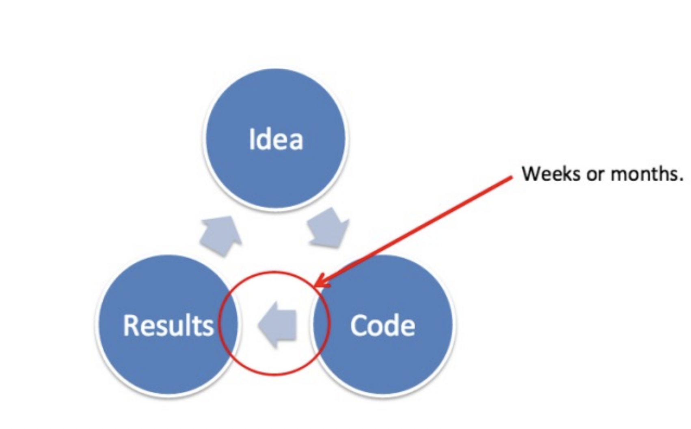

Too many computations

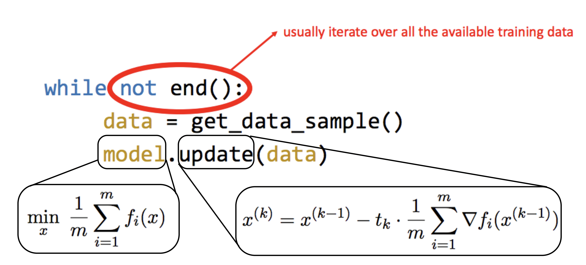

### Data Parallelism

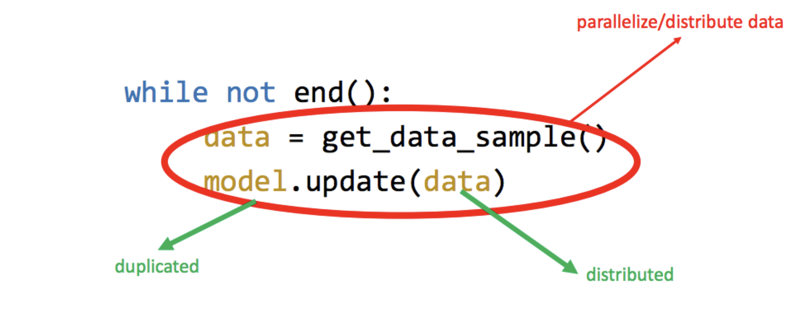

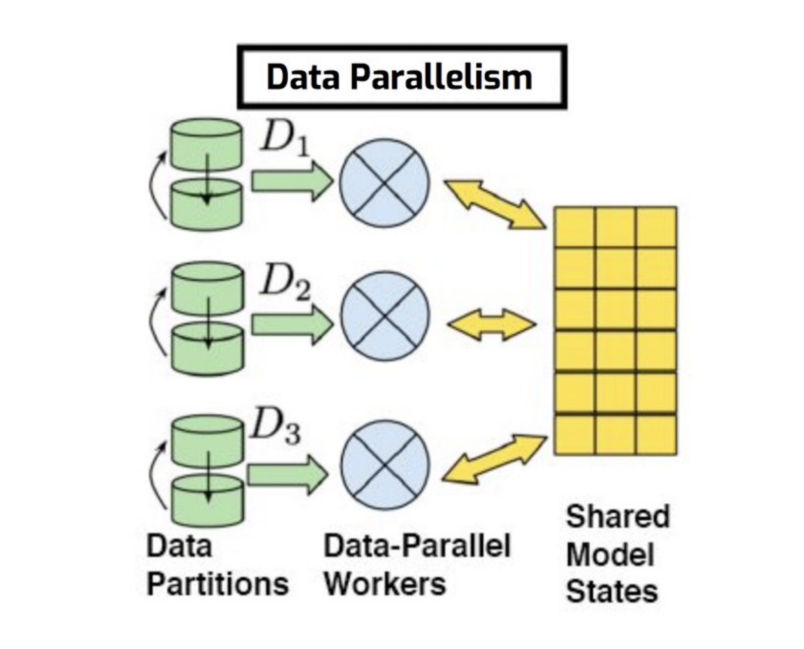

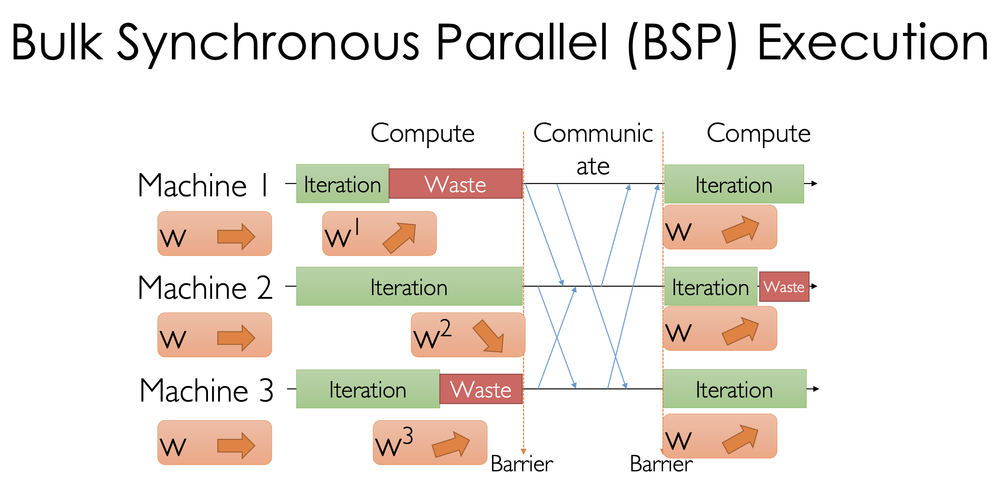

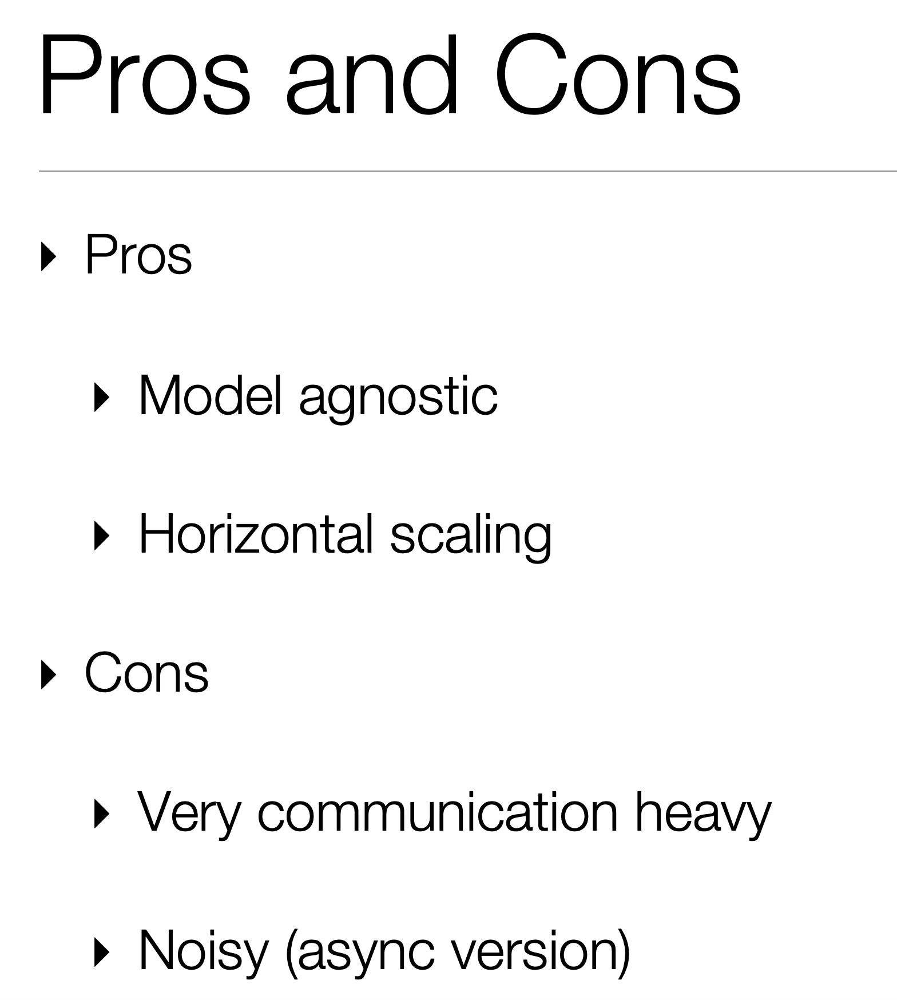

#### All Reduce

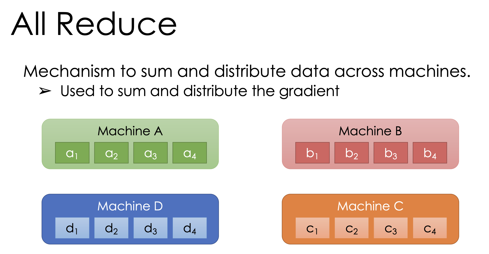

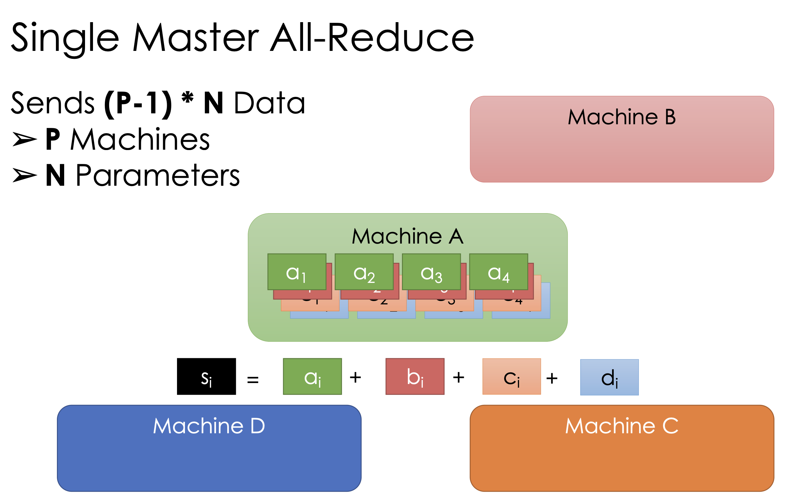

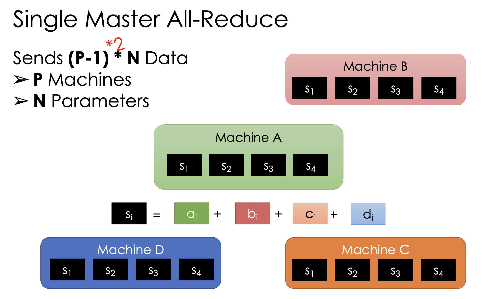

##### Issue 
  
  - Master is the bottleneck for scaling up
  - Most of the bandwidth and computation go to Master, while Workers not doing things

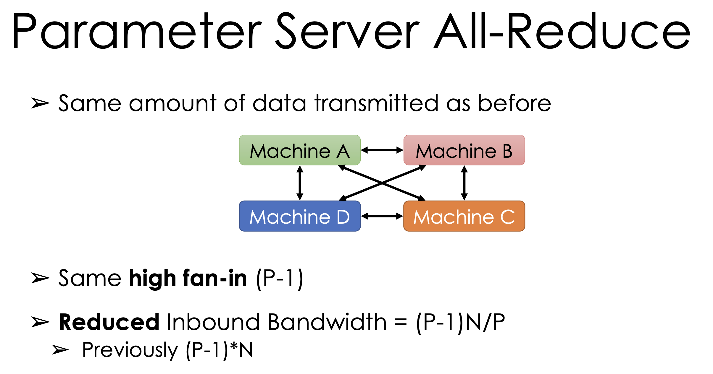

(P - 1) * N is all parameters in the cluster
(P - 1) * N / p is the amount of parameters that each machine deals with

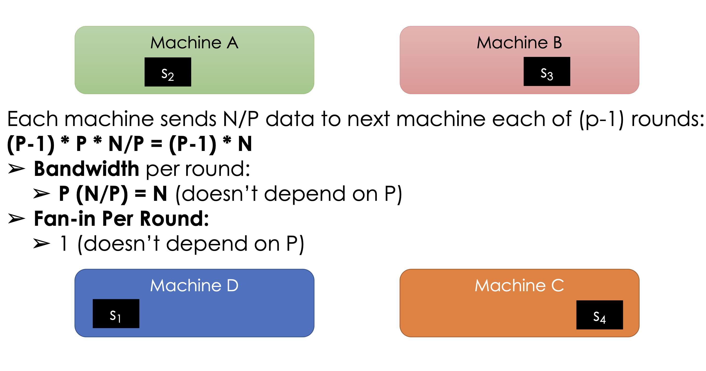

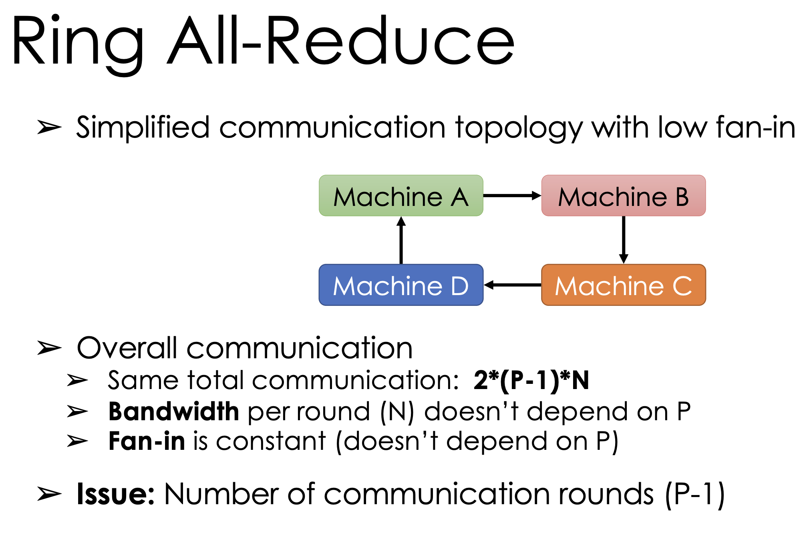

##### Description

- Each machine send a parameter to other machine
- Each machine receive required parameters for one sum
- Each machine do sum up, and share the result to each other

### Model Parallelism

Works best for models that each individual part can be computed at parallel. In the following example, as GPU0 finishes mat mul, it can pass to GPU 1 and GPU1 can work on add. Don't have to wait all works of mat mul to finish before doing add.

Sometimes, we use a combination of data parallelism, and model parallelism.

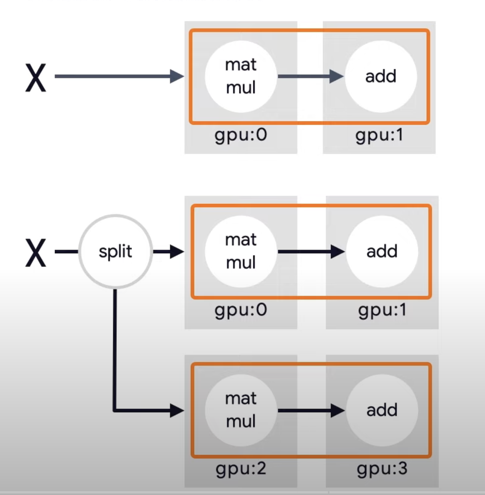