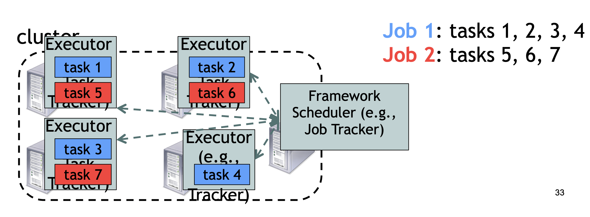
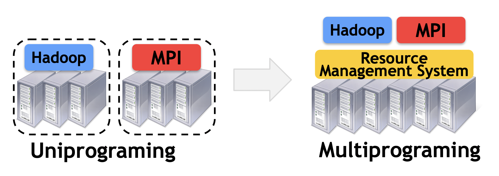
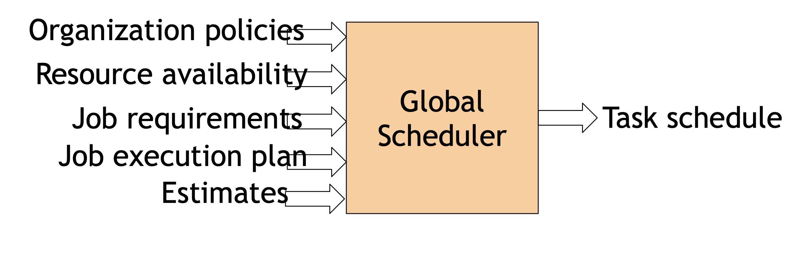
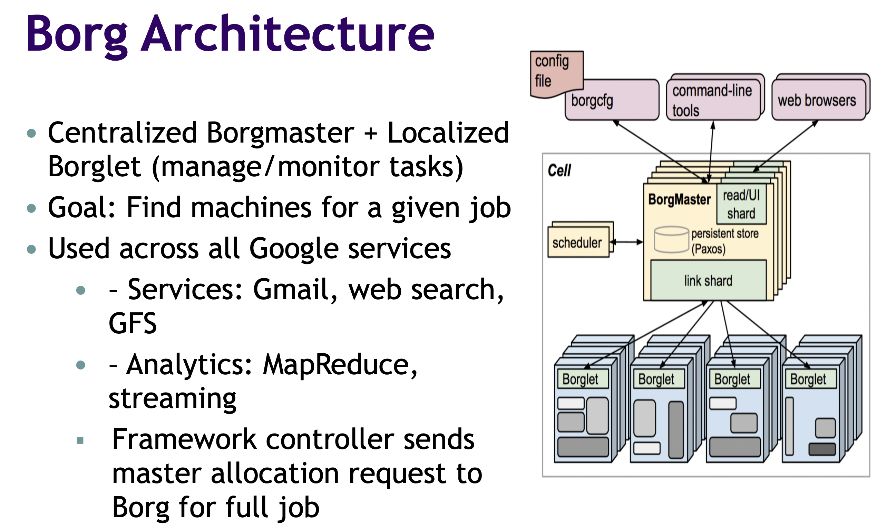
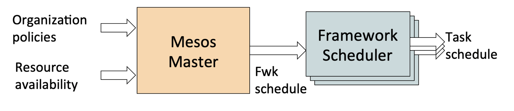
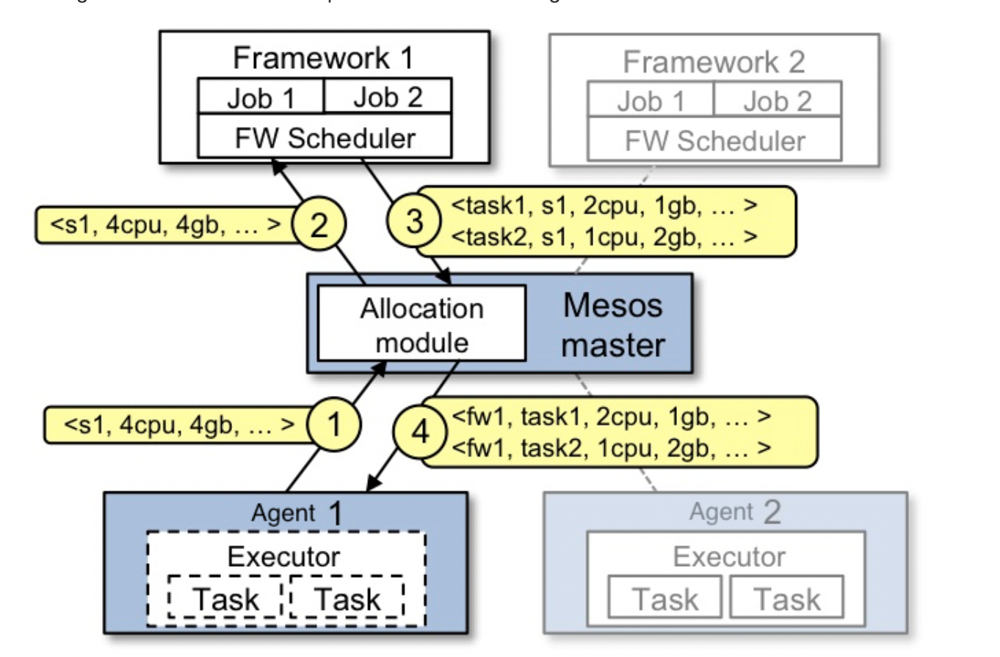
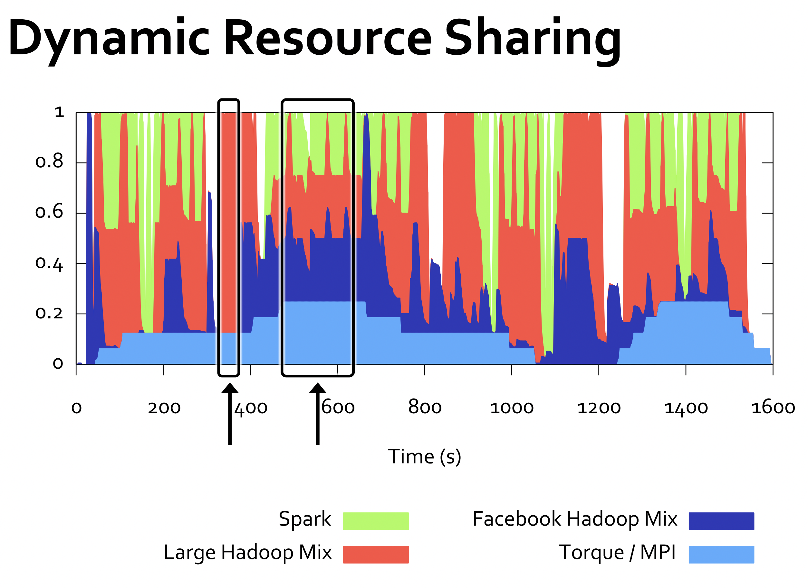

# System Architecture for Big Data Scheduling

### Motivation
- No single framework optimal for all application
- Each framework dedicated for certain cluster or certain task
- **Efficient utilization** of resources
- **Support diverse frameworks**
- **Scalability** to 10,000's of nodes
- **Reliability** in face of node failures

## Frameworks
  - A **framework** manages one or more jobs
  - A **job** consists of one or more **tasks**
  - A **task** (map, reduce, etc) is implemented by one or more processes running on a single machine
    

    ### Challenge of single framework cluster

    - Cluster is designed to run ***multiple*** frameworks and tasks in parallel 
    - **Insufficient resource usage**
      - Cluster's components like scheduler are optimized for running many frameworks, running a single one makes scheduler optimized code for nothing and may cause overhead for single framework
      - Single framework may not be able to use all resource (heavy cpu and light memory)

    - **Hard to share** data between clusters
      - Copy or access remotely is expensive
    - Hard to cooperate
      - Not easy for Pregel to use data generated by hadoop 

    ### Common resource sharing layer

    - **Abstracts** resources to frameworks and enable frameworks to **share** resources, also makes developing new frameworks easier (**Spark** as a replacement for MapReduce)
    
    

#### Fine Grained Resource Sharing 

- allowing cluster to share resources at more granular level, allowing frameworks to achieve data locality by taking turns reading data stored on each machine

- Improved data locality - storing and processing data in same physical machine

## Approach

- Global Scheduler
  
- Distributed Scheduler
  - **Mesos**

  ### Global Scheduler

    

    - **Advantage**: optimal schedule
    - **Disadvantage**
      - Complexity: hard to scale and ensure resilience
      - Hard to anticipate future frameworks' requirement
      - Need to refactr existing frameworks
    
    

  ### Mesos - a distributed resource manager

  - [Official Apache Mesos Architecture Explanation](https://mesos.apache.org/documentation/latest/architecture/)
  - **Advantages** 
    - Simple, easier to **scale** and make **resilient**
    - Easy to port existing frameworks, and support new ones (**Welcome new buddies!!!**)
  - **Disadvantage**
    - Not as optimal as global resource manager
  
  
    #### Resource Offers

    - ***Resource Offers*** is the basic unit of allocation in Mesos
    - Master sends resources offers to frameworks
    - Frameworks select whcih offers to accept and which tasks to run
    - Master determines **how many** resources are offered to each framework
    - Framework schedulers determines **which** of the offered resource to use, and how to use it. Each frameworks can **wait** for an offer that matches its constraints or preferences, and <b>reject</b> offers it does not like

    

    #### Explaination 

    1. Mesos Agent on Node 1 reports have 4 CPUs and 4GB of memory free. 
    2. Mesos Master send framework 1 (actually send to all frameworks)
    3. Framework 1 accepts the offer and use the resource to run task 1 and task 2, and send this info to Mesos Master
    4. Mesos Master forward the tasks to Node 1

    

    #### Performance

    - **Ramp-up time low** under most scenarios
    - Barely any performance diferences between global and distributed schedulers in Facebook workload
    - **Optimizations**
      - Master doesn't send an offer that is rejected by a framework (negative **caching**)
      - Allow frameworks to specify **white and black lists** of nodes
        
