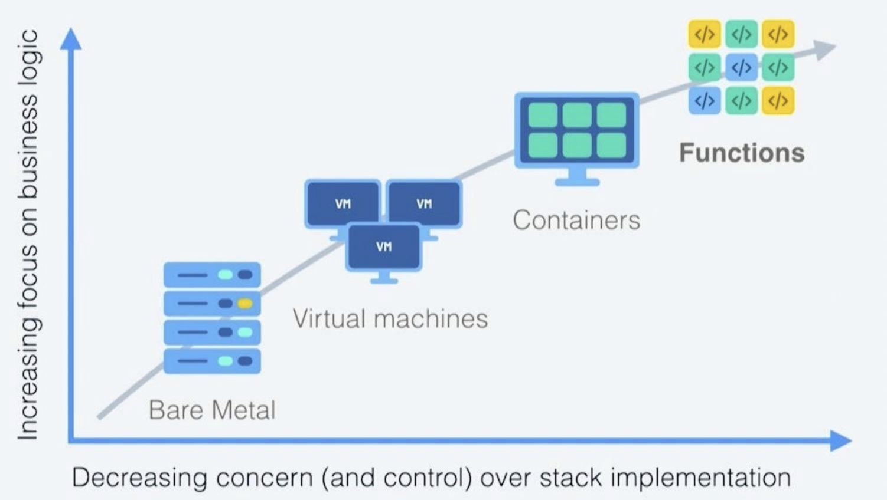
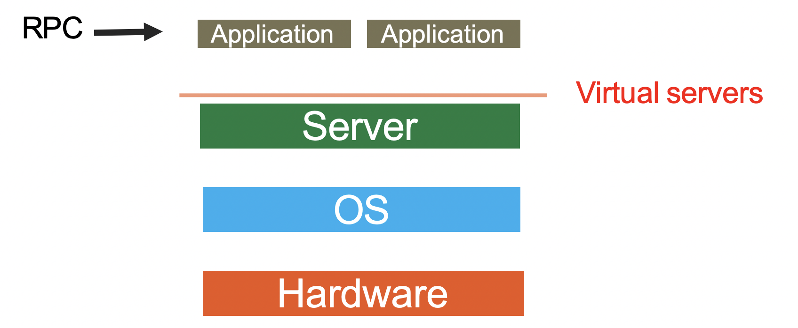
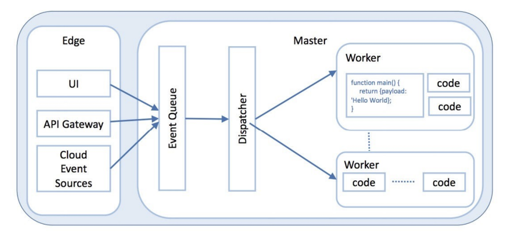
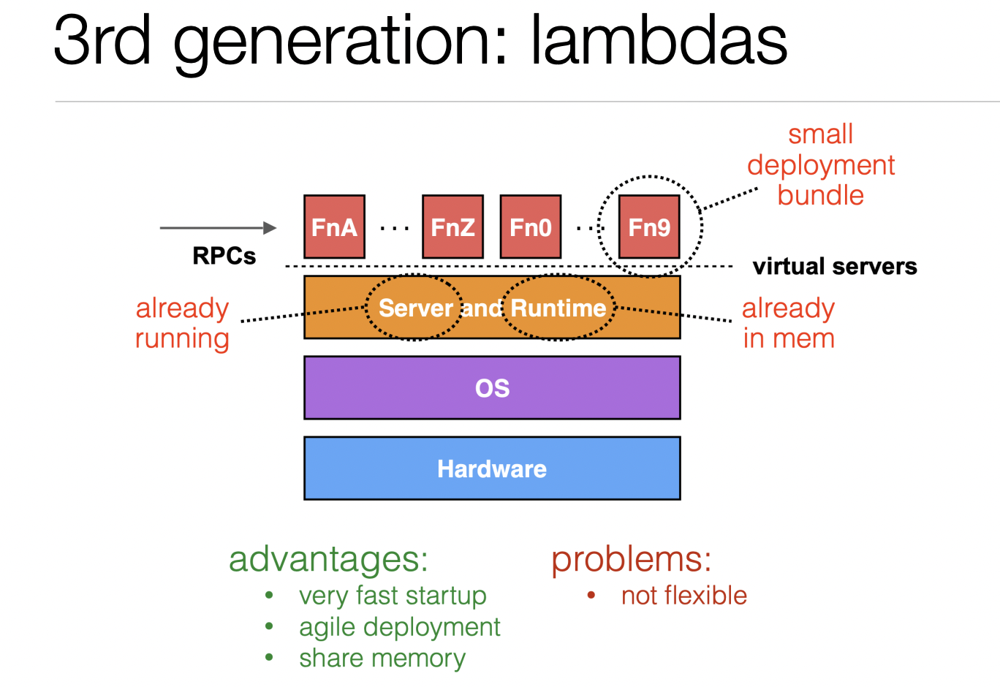
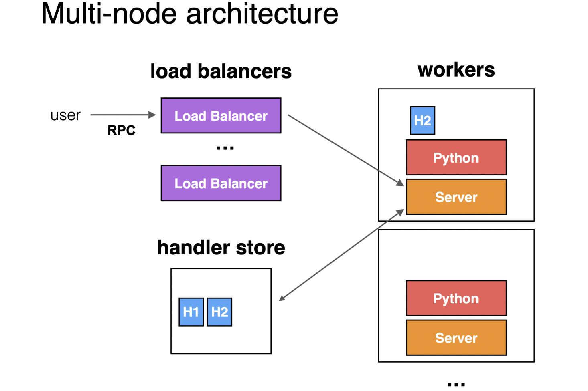
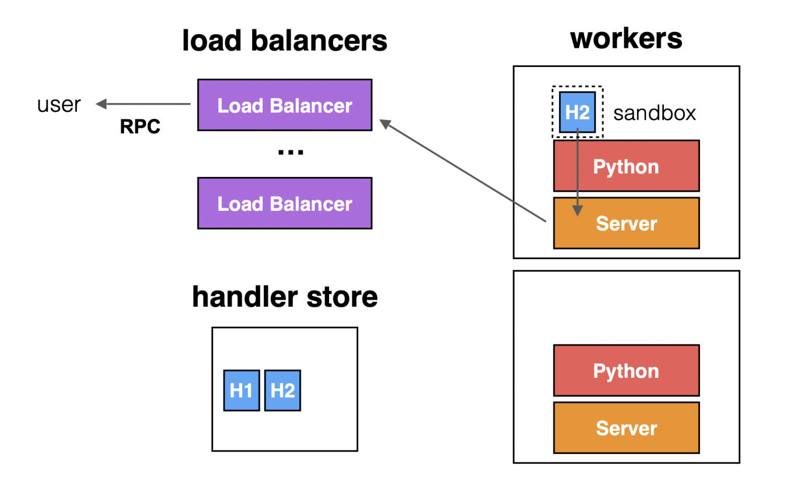

# Virtualization 3 - Serverless Computing

**Definition** 
- A cloud computing model that handles the backend **infrastructure**, and **automically** allocates resources as needed to executes and **scales** the application. 
- Application **always have** required resources. 
- Allowing developers to care about application codes only. 
- **Avoid over-provisoning** and wasted resources. 
- **No server or container management**
- **Flexible scaling**
- High availability 
- No idle capacity
- **Only pay for what you see**

## Evolution of Serverless

#### Today's Serverless Computing

- Largely offered as Function as a Service (**FaaS**)
  - Cloud users write functions and ship them
  - Cloud provider runs and manages them
- Still runs on servers
  - Key point is cloud providers **abstract away** underlying **infrastructure** for developers
  - Whether or not the application is **running on server is not important**
- Attractive but have limitations

#### Overview of Architecture of Serverless Computing
  

**Explaination**

- Manages a set of user defined functions
- Take an event sent over HTTP or received from an event source
- Determine function(s) of which to dispatch the event
- Find an existing instance of function or create a new one (**auto-scaling**)
- Send event to the function instance
- Wait for response
- Gather execution logs
- Make the response available to the user
- Stop the function when it is no longer needed

### AWS Lambda - A Serverless Computing Platform

- **About**
  - An event driven, serverless computing **FaaS** platform 
  - **Connected** with many **other AWS services**
- **Functions**
  - Functions can be written in Node.js, Python, Java, Go, Ruby, C#, PowerShell
  - Each function allowed to take 128MB - 3GB memory and up to 15 min
  - Max 1000 concurrent functions
- **Function Triggering**
  - **Run user handlers** in reponse to events
  - **Web** request (**RPC** handlers)
  - **Database** updates (**triggers**)
  - **Scheduled** events (**cron jobs**)
- **Billing**
  - Pay **per function invocation**
  - No charge when no function running
  - Billed by duration of function, configured memory size, and number of functions
- **Shared everything**
  - Share server pool between customers
  - Any worker can execute any handler
  - No spinup time
  - Less switching
- Encourage specfic runtime (C#, Node.js, Python)

## Multi-node architecture
- Developers upload function code to a *handler store* (and associate it with a URL)
- Events trigger functions via RPC (to the URL)
- Load balancers handle RPC requests by starting *handlers* on workers
  - Calls to the same function usally go to same worker
- Handlers sandboxed in containers (managed by AWS)
  - AWS Lambda reuses the same container to execute multiple handlers when possible

## Limitation of Today's Serverless Offerings
- **Difficult to manage states**
  - Have to use (**slow**) cloud storage
- No easy or fast way to communicate across functions
  - Have to go through cloud storage or other services
- Functions can only use limited resources
- No control over locality
  - Cold start can be slow (run a function on a machine that has not execute this function, loading and installing or readying the container to machine takes time)

**Use cases** of **Today's** FaaS

- Good use cases
  - Parallel, independent, stateless tasks
  - Event-triggered, synchronous processing
  - Ephemeral with highly dynamic demand
- Bad use cases
  - Stateful applications
  - Distributed applications and protocols
  - Applications that demand more resources