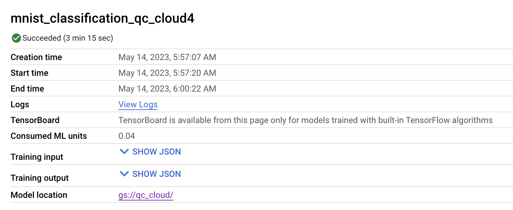

## MNIST Classification On Google AI Platform

### Training Locally On One Machine

I'm using Tensorflow to train this model

#### Load MNIST dataset

```
from keras.datasets import mnist
from keras.utils import to_categorical
(train_images, train_labels), (test_images, test_labels) = mnist.load_data()

train_images = train_images.reshape((60000,28,28,1))
train_images = train_images.astype('float32')/255

test_images = test_images.reshape((10000,28,28,1))
test_images = test_images.astype('float32')/255


train_labels = to_categorical(train_labels)
test_labels = to_categorical(test_labels)
```

#### Code for model

```
from keras import optimizers
from keras import layers
from keras import models
import tensorflow as tf

def create_model():
    model = models.Sequential()
    model.add(layers.Conv2D(32, (3, 3), activation='relu', input_shape=(28, 28, 1)))
    model.add(layers.MaxPooling2D((2, 2)))
    model.add(layers.Conv2D(64, (3, 3), activation='relu'))
    model.add(layers.MaxPooling2D((2, 2)))
    model.add(layers.Conv2D(64, (3, 3), activation='relu'))
    model.add(layers.Flatten())
    model.add(layers.Dense(64, activation='relu'))
    model.add(layers.Dense(10, activation='softmax'))
    return model


model = create_model()
model.summary()
model.compile(optimizer=optimizers.SGD(learning_rate=0.01, momentum=0.9),
            loss='categorical_crossentropy',
            metrics=['accuracy']
            )
```
Strategy is the TensorFlow way to determine how a model be trained, and MultiWorkerMirroredStrategy is how we do synchronous data parallelism across multiple machines. There are other Strategies such as MirroredStrategy which is synchronous data parallelism on one machine with many GPUs, or ParameterServerStrategy which is asynchronous data parallelism and we will be using this one later.

#### Run the model and evaluate
This is running locally on my machine that have only one GPU. 


### Doing Distributed Training on GCP AI Platform

#### Refactor Code

Before create docker image and work with cloud, we need to change our training code a little bit. We instantiate a `MultiWorkerMirroredStrategy()` object and wrap the creation of model inside the strategy scope.

##### Before

```
model = create_model()
model.summary()
model.compile(optimizer=optimizers.SGD(learning_rate=0.01, momentum=0.9),
            loss='categorical_crossentropy',
            metrics=['accuracy']
            )
```

##### After

```
strategy = tf.distribute.MultiWorkerMirroredStrategy()
with strategy.scope():
    model = create_model()
    model.summary()
    model.compile(optimizer=optimizers.SGD(learning_rate=0.01, momentum=0.9),
                loss='categorical_crossentropy',
                metrics=['accuracy']
                )
```


#### Code of Saving Model in my GCP Bucket


```
import os
model_path = "gs://qc_cloud/mnist_classification_multiworkermirrored"
 
# Note that with MultiWorkerMirroredStrategy,
# the program is run on every worker.
def _is_chief(task_type):
 # Note: there are two possible `TF_CONFIG` configurations.
 #   1) In addition to `worker` tasks, a `chief` task type is used.  
 #      The implementation demonstrated here is for this case.
 #   2) Only `worker` task type is used; in this case, worker 0 is
 #      regarded as the chief. In this case, this function
 #      should be modified to
 #      return (task_type == 'worker' and task_id == 0) or task_type is None
  return task_type == 'chief'
 
 
def _get_temp_dir(dirpath, task_id):
 base_dirpath = 'workertemp_' + str(task_id)
 temp_dir = os.path.join(dirpath, base_dirpath)
 tf.io.gfile.makedirs(temp_dir)
 return temp_dir
 
def write_filepath(filepath, task_type, task_id):
 dirpath = os.path.dirname(filepath)
 base = os.path.basename(filepath)
 if not _is_chief(task_type, task_id):
   dirpath = _get_temp_dir(dirpath, task_id)
 return os.path.join(dirpath, base)
 
# Determine type and task of the machine from
# the strategy cluster resolver
task_type, task_id = (strategy.cluster_resolver.task_type,
                     strategy.cluster_resolver.task_id)
 
# Based on the type and task, write to the desired model path
write_model_path = write_filepath(model_path, task_type, task_id)
model.save(write_model_path)
```
However, according the convention on GCP AI Platform, we have to refactor the folder structure as well as the code.


`setup.py` and `__init__.py` are empty in my case, and all code goes to `task.py`.

#### Build Docker Image

We want to build our docker image before running the cluster.

##### Dockerfile

```
# Specifies base image and tag
FROM gcr.io/deeplearning-platform-release/tf2-gpu.2-11
WORKDIR /root
 
# Copies the trainer code to the docker image.
COPY trainer/ /root/trainer/
 
# Sets up the entry point to invoke the trainer.
ENTRYPOINT ["python", "-m", "trainer.task"]
```

I built the image and pushed to GCR using following command.


#### Run cluster on GCP AI Platform

GCP AI Platform has simplified a lot of the steps for us such as configuring cluster, download things on nodes, etc. We only need to provide a `config.yaml` that tells how many node should in cluster.

##### config.yaml
```
trainingInput:
 scaleTier: CUSTOM
 masterType: n1-standard-4
 masterConfig:
   imageUri: gcr.io/qc-cloud-spring-2023-cnn/mnist_classification_multiworker@sha256:11547159953b8020e3c231c6384bf16a788b612ed99ee0d39a7d4bc2b8e72ede

 useChiefInTfConfig: true
 workerType: n1-standard-4
 workerCount: 1
 workerConfig:
   imageUri: gcr.io/qc-cloud-spring-2023-cnn/mnist_classification_multiworker@sha256:11547159953b8020e3c231c6384bf16a788b612ed99ee0d39a7d4bc2b8e72ede

```

#### Submit the model training job to GCP 


It roughly take 3 minutes to train the model in a 2 node cluster for synchronous data parallelism training



We can see the model is been saved to bucket `qc_cloud`


#### Status Monitoring

##### CPU

Master 
 

Worker


##### Memory

Master 
 

Worker


Master and Worker have almost identical graph for both CPU usage and Memory usage.

In general, MultiWorkerMirroredStrategy or synchronous data parallelism is more suitable for realatedl smaller dataset than ParameterServerStrategy or asynchronous. ParameterServerStrategy reduces communication overhead. When the dataset increases, the amount of data need to be transfered in all-reduce increases. Syncing data on all machine requires a lot of network traffic which is time consuming and impact the overall performance because machines spend more time on syncing data and less time to do actual training. On the other hand, ParameterServerStrategy requires way less network traffic.


#### Evaluation

When the training finishes, it evaluates the model by run the test data on it. As we can see, the test evaluation run distributively on Master and Worker and it has and accuracy of 0.9896. We can increase this number by adding more epochs to the training, which means more iteration.


